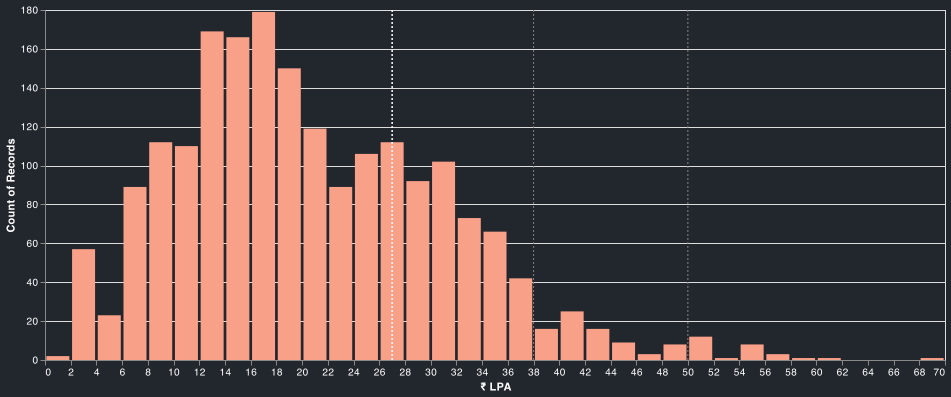

# Leetcode compensations report
Scraping and analysis of leetcode-compensations page.

`Salary Distribution`


## Report
[INDIA : Jan 2019 - July 2021](data/reports/report_2019_01_05_to_2021_08_04.md)

[INDIA : Jan 2019 - July 2021 / dark mode](data/reports/report_2019_01_05_to_2021_08_04_dark.md)


## Directory structure
- `data`
    - `imgs` - images for reports
    - `logs` - scraping logs
    - `mappings` - standardized company, location and title mappings as well as unmapped entities
    - `meta` - meta information for the posts like post_id, date, title, href.
    - `out` - data from `info.all_info.get_clean_records_for_india()`
    - `posts` - text from the post
    - `reports` - salary analysis by companies, titles and experience
- `info` - functions to posts data(along with the standardized entities) in a tabular format
- `leetcode` - scraper
- `utils` - constants and helper methods

## Setup
1. Clone the repo.
2. Put the `chromedriver` in the utils directory.
3. Setup virual enviroment `python -m venv leetcode`.
3. Install necessary packages `pip install -r requirements.txt`.
4. To create the reports `npm install vega-lite vega-cli canvas`(needed to save altair plots).

## Scraping
```python
$ export PTYHONPATH=<project_directory>
$ python leetcode/posts_meta.py --till_date 2021/08/03

# sample output
2021-08-03 19:36:07.474 | INFO     | __main__:<module>:48 - page no: 1 | # posts: 15
```
```python
$ python leetcode/posts.py

# sample output
2021-08-03 19:36:25.997 | INFO     | __main__:<module>:45 - post_id: 1380805 done!
2021-08-03 19:36:28.995 | INFO     | __main__:<module>:45 - post_id: 1380646 done!
2021-08-03 19:36:31.631 | INFO     | __main__:<module>:45 - post_id: 1380542 done!
2021-08-03 19:36:34.727 | INFO     | __main__:<module>:45 - post_id: 1380068 done!
2021-08-03 19:36:37.280 | INFO     | __main__:<module>:45 - post_id: 1379990 done!
2021-08-03 19:36:40.509 | INFO     | __main__:<module>:45 - post_id: 1379903 done!
2021-08-03 19:36:41.096 | WARNING  | __main__:<module>:34 - sleeping extra for post_id: 1379487
2021-08-03 19:36:44.530 | INFO     | __main__:<module>:45 - post_id: 1379487 done!
2021-08-03 19:36:47.115 | INFO     | __main__:<module>:45 - post_id: 1379208 done!
2021-08-03 19:36:49.660 | INFO     | __main__:<module>:45 - post_id: 1378689 done!
2021-08-03 19:36:50.470 | WARNING  | __main__:<module>:34 - sleeping extra for post_id: 1378620
2021-08-03 19:36:53.866 | INFO     | __main__:<module>:45 - post_id: 1378620 done!
2021-08-03 19:36:57.203 | INFO     | __main__:<module>:45 - post_id: 1378334 done!
2021-08-03 19:37:00.570 | INFO     | __main__:<module>:45 - post_id: 1378288 done!
2021-08-03 19:37:03.226 | INFO     | __main__:<module>:45 - post_id: 1378181 done!
2021-08-03 19:37:05.895 | INFO     | __main__:<module>:45 - post_id: 1378113 done!
```

## Report DataFrame
```python
$ ipython

In [1]: from info.all_info import get_clean_records_for_india                                                               
In [2]: df = get_clean_records_for_india()                                                                                  
2021-08-04 15:47:11.615 | INFO     | info.all_info:get_raw_records:95 - n records: 4134
2021-08-04 15:47:11.616 | WARNING  | info.all_info:get_raw_records:97 - missing post_ids: ['1347044', '1193859', '1208031', '1352074', '1308645', '1206533', '1309603', '1308672', '1271172', '214751', '1317751', '1342147', '1308728', '1138584']
2021-08-04 15:47:11.696 | WARNING  | info.all_info:_save_unmapped_labels:54 - 35 unmapped company saved
2021-08-04 15:47:11.705 | WARNING  | info.all_info:_save_unmapped_labels:54 - 353 unmapped title saved
2021-08-04 15:47:11.708 | WARNING  | info.all_info:get_clean_records_for_india:122 - 1779 rows dropped(location!=india)
2021-08-04 15:47:11.709 | WARNING  | info.all_info:get_clean_records_for_india:128 - 385 rows dropped(incomplete info)
2021-08-04 15:47:11.710 | WARNING  | info.all_info:get_clean_records_for_india:134 - 7 rows dropped(internships)
In [3]: df.shape                                                                                                            
Out[3]: (1963, 14)
```

## Report
```python
$ python reports/plots.py # generate plots
$ python reports/report.py
$ python reports/report_dark.py # dark mode
```

## Samples
title : Flipkart | Software Development Engineer-1 | Bangalore<br>
url : https://leetcode.com/discuss/compensation/834212/Flipkart-or-Software-Development-Engineer-1-or-Bangalore<br>
company : `flipkart`<br>
title : `sde 1`<br>
yoe : `0.0` years<br>
salary : `₹ 1800000.0`<br>
location : `bangalore`<br>
`post`
Education: B.Tech from NIT (2021 passout)
Years of Experience: 0
Prior Experience: Fresher
Date of the Offer: Aug 2020
Company: Flipkart
Title/Level: Software Development Engineer-1
Location: Bangalore
Salary: INR 18,00,000
Performance Incentive: INR 1,80,000 (10% of base pay)
ESOPs: 48 units => INR 5,07,734 (vested over 4 years. 25% each year)
Relocation Reimbursement: INR 40,000
Telephone Reimbursement: INR 12,000
Home Broadband Reimbursement: INR 12,000
Gratuity: INR 38,961
Insurance: INR 27,000
Other Benefits: INR 40,000 (15 days accomodation + travel) (this is different from the relocation reimbursement)
Total comp (Salary + Bonus + Stock): Total CTC: INR 26,57,695; First year: INR 22,76,895
Other details: Standard Offer for On-Campus Hire
Allowed Branches: B.Tech CSE/IT (6.0 CGPA & above)
Process consisted of Coding test & 3 rounds of interviews. I don't remember questions exactly. But they vary from topics such as Graph(Topological Sort, Bi-Partite Graph), Trie based questions, DP based questions both recursive and dp approach, trees, Backtracking.<br>


title : Cloudera | SSE | Bangalore | 2019<br>
url : https://leetcode.com/discuss/compensation/388432/Cloudera-or-SSE-or-Bangalore-or-2019<br>
company : `cloudera`<br>
title : `sde 2`<br>
yoe : `2.5` years<br>
salary : `₹ 2800000.0`<br>
location : `bangalore`<br>
`post`
Education: MTech from Tier 1 College
Years of Experience: 2.5
Prior Experience: SDE at Flipkart
Date of the Offer: Sept 10, 2019
Company: Cloudera
Title/Level: Senior Software Engineer (SSE)
Location: Bangalore, India
Salary: Rs 28,00,000
Bonus: Rs 2,80,000 (10 % of base)
PF & Gratuity: Rs 1,88,272
Stock bonus: 5000 units over 4 years ($9 per unit)
Other Benefits: Rs 4,00,000 (Health, Term Life and Personal Accident Insurance, Annual Medical Health Checkup, Transportation, Education Reimbursement)
Total comp (Salary + Bonus + Stock): Rs 4070572<br>


title : Amadeus Labs | MTS | Bengaluru<br>
url : https://leetcode.com/discuss/compensation/1109046/Amadeus-Labs-or-MTS-or-Bengaluru<br>
company : `amadeus labs`<br>
title : `mts 1`<br>
yoe : `7.0` years<br>
salary : `₹ 1700000.0`<br>
location : `bangalore`<br>
`post`
Education: B.Tech. in ECE
Years of Experience: 7
Prior Experience: Worked at few MNCs
Date of the Offer: Jan 2021
Company: Amadeus Labs
Title/Level: Member of Technical Staff
Location: Bengaluru, India
Salary: ₹ 1,700,000
Signing Bonus: ₹ 50,000
Stock bonus: None
Bonus: 137,000
Total comp (Salary + Bonus + Stock): ~₹1,887,000
Benefits: Employee and family Insurance<br>