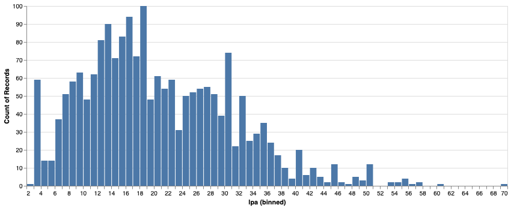
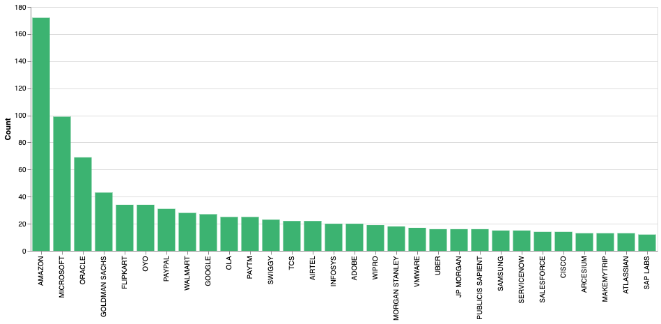
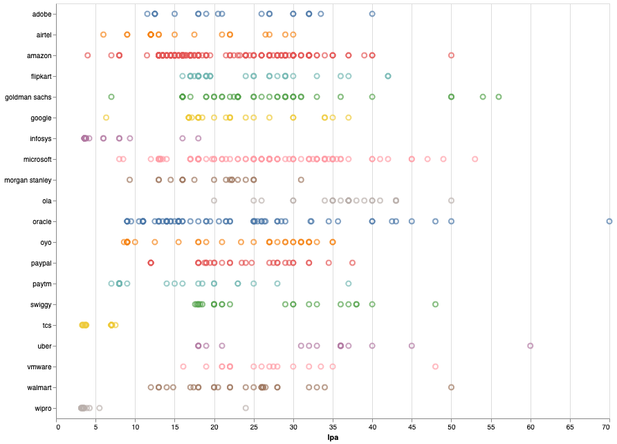
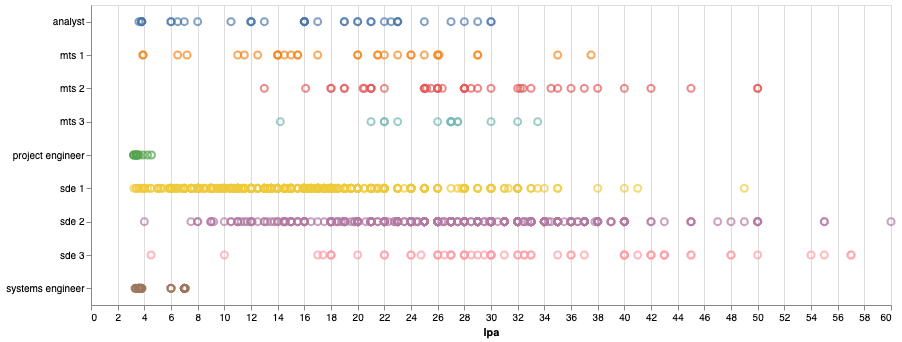
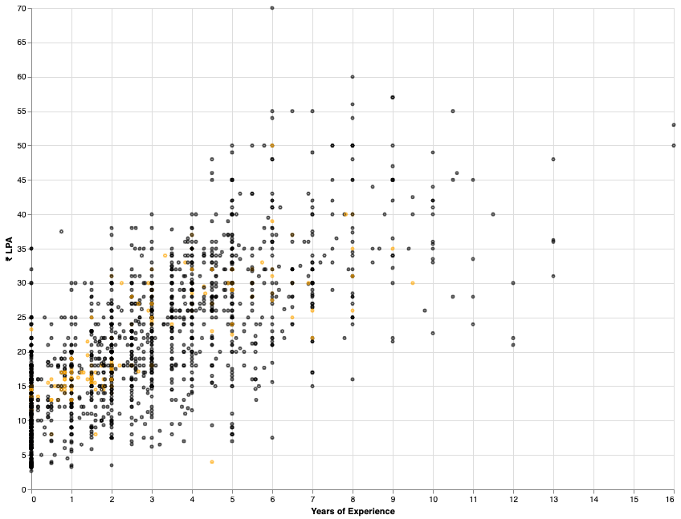
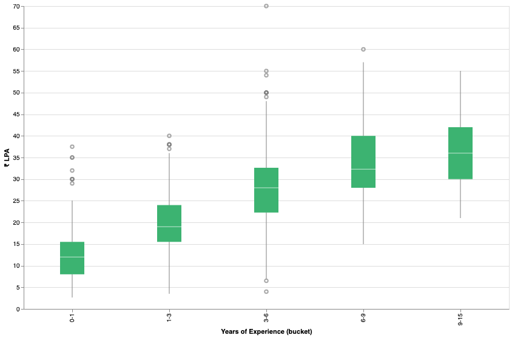
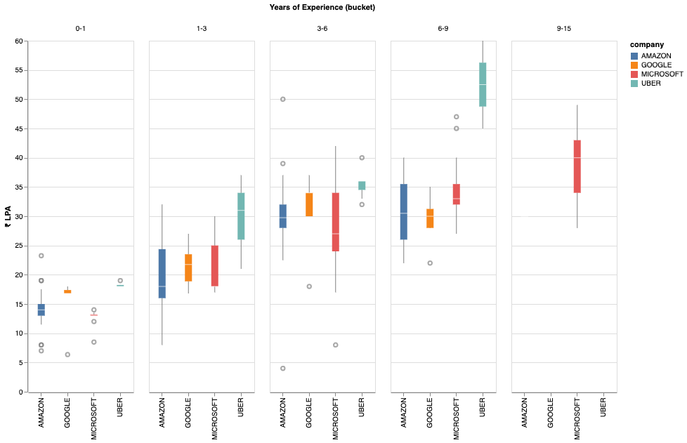

## Notes
- Reports are generated from `1940` records collected till `Jul 22`(from the `272` pages avaliable on the compensations page).
- Filtered for `India`.
- Salary mentioned in the reports is the `fixed salary`.
- Vertical lines in some of the charts indicate the `75th`, `95th` and the `99th` percentile of the `fixed salaries`.

`Salary Distribution`

`Company Counts`

`Salaries by Companies`

`Salaries by Titles`

`Salaries by Experience(with amazon highlighted)`

`Salaries by Experience buckets`

`Salaries by Experience buckets(top comapnies)`

## Top Offers
| Company | Title | YOE | Salary | Location | Original Post
| --- | --- | --- | --- | --- | --- |
| `ORACLE` | N/A | 6.0 | ₹ 7000000 | hyderabad | "education: b. tech in cse\nyears of experience: 6\nprior experience: sde 3 @ top 4 firm\ndate of the offer: q1 2021\ncompany: oracle\ntitle/level: pmts - ic4\nlocation: hyderabad, india inr\nsalary: 70,00,000 inr\nrelocation/signing bonus: 24,00,000 inr (signing bonus)\nstock bonus: 2500 units = $45k per yr for 4 years\nbonus: n/a\ntotal comp (salary + bonus + stock): 102l inr\nbenefits: standard oracle benefits\nother details: current tc is ~90l\nwould like to hear the thoughts of the community on this.\ni know it looks like a good offer, but think from 2 perspectives -\nthere is not a huge bump being offered over my current comp\ni am concerned about oci. i've worked with only the top 4 firms so far so also worried that this might be a step down on my profile.\nlol downvoters, can you explain why you are downvoting the post? what can op do to help improve this?" |
| `UBER` | SDE 2 | 8.0 | ₹ 6000000 | bangalore | "education: b tech from tier 2 uni\nyears of experience: 8 yrs\nprior experience: senior developer in a startup.\ndate of the offer: december ,2020\ncompany: uber\ntitle/level: senior software engineer( l5a )\nlocation: bangalore\nbase salary: 60l\nsigning bonus: 10l\nstock bonus: 130k usd over 4 years\nperformance bonus: 12 l minimum (2x maximum)\ntotal comp (base + minimum bonus + sign on + stock): 60 + 12 + 10 + 24 = 106 l\nbenefits: usual uber benefits (uber credits, 17% discount on any uber order, etc..)\nother details: no negotiation as this was a good offer. got a google l4 offer as well. but rejected as they couldn't match uber numbers.\nprevious tc: 44l base + 12.5l pre-ipo paper money" |
| `GOJEK` | SDE 3 | 9.0 | ₹ 5700000 | bangalore | "education: b.tech, cse\nyears of experience: ~9 years\nprior experience: with one of the unicorn in india\ndate of offer: march 2021\ncompany: gojek\ntitle/level: lead software engineer\nlocation: bangalore\nbase pay: 57l +3.42l pf\nannual bonus: 11.4l which goes upto 22.8l\nsigning bonus: they don't provide\nstock bonus: 70k usd (4 years) rsu\ntotal comp (salary + bonus): ~72l\nbenefits: 6l medical insurance, various annual reimbursements worth ~50k\ninterview experience:\ni applied through linkedin for principal engineer but they offered lead engineer position\nround1: lld on already coded piece. focus is on tdd\nround2: detailed discussion around current projects/system. certain questions around the existing design choices and different trade-offs (two interviewers)\nround3: design bill payments system where third-party are dynamically added. some questions around functional paradigm and consistency guarantees with kafka (two interviewers)\nround4: this was the bar raiser round. mostly behavioral questions\nround5: hr round on overall fitment" |
| `TESCO` | SDE 3 | 9.0 | ₹ 5700000 | bangalore | 'education: be\nyears of experience: 9\ndate of the offer: nov 2020\ncompany: tesco\ntitle/level: sde 3 (architect)\nlocation: bangalore\nsalary: 57,00000 (57 lpa)\nsigning bonus: 5 lpa\nstock bonus: n/a\nbonus: performance - 15% of base (~9 lpa)\ntotal comp (salary + bonus + stock): 71 lpa first year\nbenefits: broadband/phone reimbursemt, insurance, cab etc.' |
| `GOLDMAN SACHS` | VP | 8.0 | ₹ 5600000 | bangalore | 'education: btech cse from nit\nyears of experience: 8 years\nprior experience: faang\ndate of the offer: 28-july-2020\ncompany: goldman sacs\ntitle/level: vice president\nlocation: bengaluru\nsalary: 56 lpa\nrelocation/signing bonus: n/a\nstock bonus: 27000$ over 3 years.\nbonus: 10 lpa for first year.\ntotal comp (salary + bonus + stock): 71 for first year (including stocks and pro rated bonus for first year).\nbenefits: standard benefits\nother details: had other competing offers and gs barely matched the other offers.\nnote : looking for feedback from the community on the offer. i feel that i am being lowballed.' |
| `ZETA` | SDE 2 | 6.5 | ₹ 5500000 | bangalore | 'education: b.e in computer science (iit/bits)\nyears of experience: 6.5\nprior experience: startups\nprevious compensation: 43l + 7l stocks\ndate of the offer: april 2021\ncompany: zeta suite\ntitle/level: senior software development engineer\nlocation: bangalore\nsalary: 55l\nsigning bonus: 5l\nstock bonus: 27l(10%, 20%, 30%, 40% vested per year)\nbonus: 5l\ntotal comp (salary + bonus + stock): 67l first year\nbenefits: zeta benefits\nother details: interview procedure:-ps/dsa round, machine coding/design discussion, hiring manager\ni had 3 other competing offers' |
| `TOWER RESEARCH CAPITAL` | SDE 2 | 10.5 | ₹ 5500000 | delhi | 'education:m.tech. (iiit-hyd)\nyears of experience:10.5\nprior experience:product based (not faang)\nprevious compensation: 32.5l + 3.5l bonus\ncompany: tower research capital\ntitle/level:senior software engineer\nlocation:gurugram\nsalary:55 lpa\nrelocation/signing bonus:1lpa relocation + 5 lpa signining\nstock bonus: none\nbonus:20l\ntotal comp (salary + bonus + stock):75l\nbenefits:3.5l yearly\nother details:10l medical, 4xbase salary as term insurance plan' |
| `JUMIO` | SDE 3 | 6.0 | ₹ 5500000 | bangalore | 'education : be\nyears of experience : 6\nprior experience : 6 years in multiple product startups\ndate of offer : may 2021\ncompany: jumio\ntitle : sde 3\nlocation : bangalore\nbase salary : 55,00,000\njoining bonus : 4,00,000\nvariable: 5,50,000\nstocks : 3000 esops\ntotal ctc ~ 64,50,000 excluding esops\ndeclined the offer as i had a better offer.' |
| `INMOBI` | SDE 4 | 7.0 | ₹ 5500000 | bangalore | 'education: btech in computer science\nyears of experience: 7\nprior experience: sde 3 at a startup\ndate of the offer: 01/11/2020\ncompany: inmobi\ntitle/level: sde 4 (senior tech lead)\nlocation: bangalore\nsalary: 55,00,000 base\nsigning bonus: 8,00,000 (4,00,000 first year + 4,00,000 second year)\nstock bonus: 50,00,000 vested over 4 years.\ntotal comp (salary + bonus + stock): 71,00,000 (with stocks)\nbenefits: standard\n\ncurrent tc: 44,00,000\nother details: didn\'t negotiate yet. don\'t have any competing offers as all my interviews are lined up in the next few weeks. this was supposed to be my "warm up" interview.\nbut i think, this offer is good and will most probably accept.\n\na couple of people have commented asking about my experience, career path and advice for juniors. i\'m adding some more details and my thoughts here,\nin my 7 yoe, i spent 4.5 years in a very early stage no-name startup. though i was paid less here, my learnings were huge. i was responsible for whole end to end tech stack and it helped me get so much experience which would not be possible in big companies/startups. this was the main reason i was able to clear system design interviews with ease. as i had hands-on experience in each system design aspect, i did not need much preparation for that. so, in early career, join a startup with good engineering foundation and learn. it does not matter if startup fails or succeeds, you are still very young and can try out different paths at this stage.\nthis is not an outlier offer. this is standard for sde 4 and above in many companies. as you could see the breakup, stocks take up a good amount of portion. inmobi is going for ipo next year. so i belive stocks would appreciate later.\nplease do proper research about market standard on bli-d and other salary discussion threads. inmobi is a good company as they did not try to low-ball me and compensated me purely based on interview feedback. i was surprised to hear this number but i got to know later from bli-d posts that this was a standard offer. if i had competing offers, this number would have gone even higher.\nbefore a few years, i was on the same path as most of you, reading compensation threads and wondering even if they were real. but as i progressed on my career, i came to know that these numbers are very real and they are not out of reach for anybody. just focus on your career and the money follows.' |
| `EMERGING UNICORN FINTECH` | SDE 3 | 6.0 | ₹ 5400000 | bangalore | "education: from tier 1 college\nexisting company : product based company\nyears of experience: ~6\ncompany: emerging unicorn - fintech\ntitle: sde 3\nlocation: bangalore\njoining: july 2021\nbase: 54 lpa\nannual bonus : 6 lpa\nesops : 18 lpa (for 4 years)\njb : 8 lpa\nctc (1st year) : (54 + 6 + 4.5 + 8) = 72.5 lpa\ncurrent tc : 54 lpa (including rsus)\nhad a max offer from salesforce of around ~65 lpa to negotiate, could maxinum get the above number.\nplease let me know guys if it's a decent number at 6+ years of experience and considering the risk of a startup involved, still thinking whether to accept the offer." |