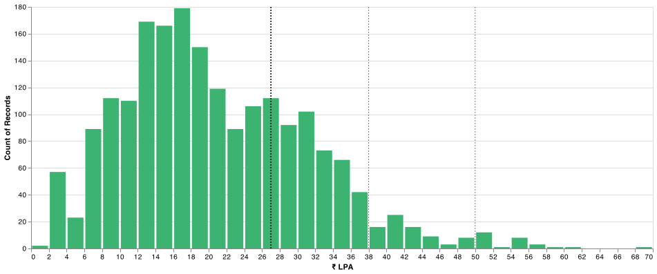
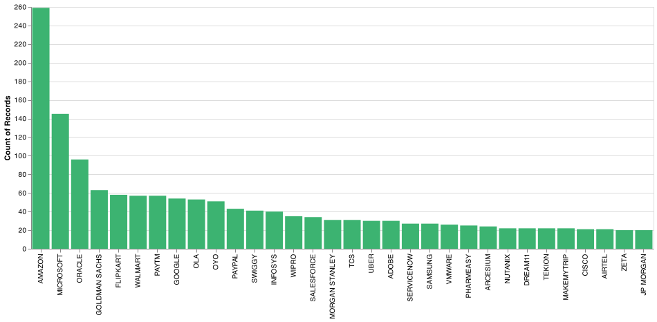
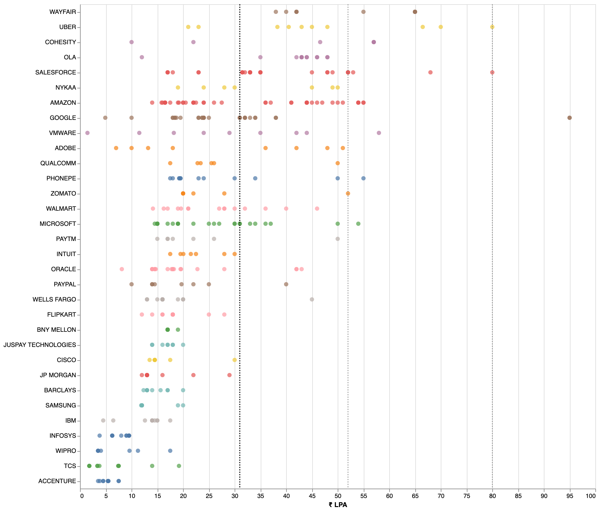
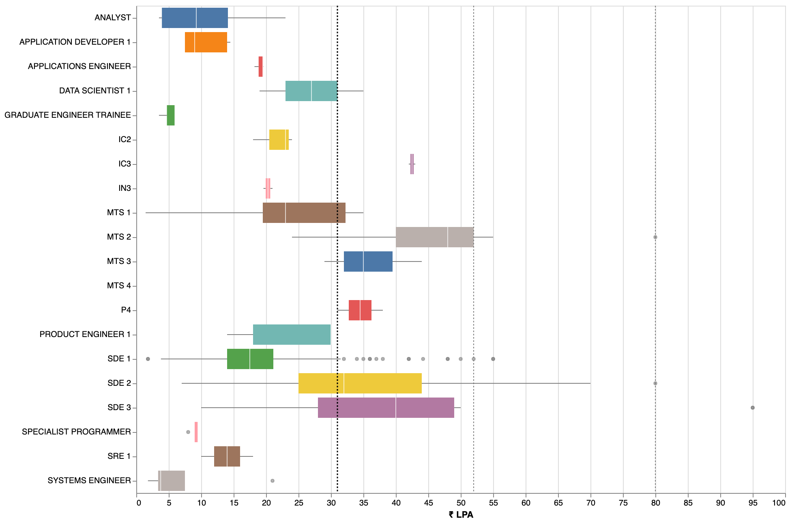
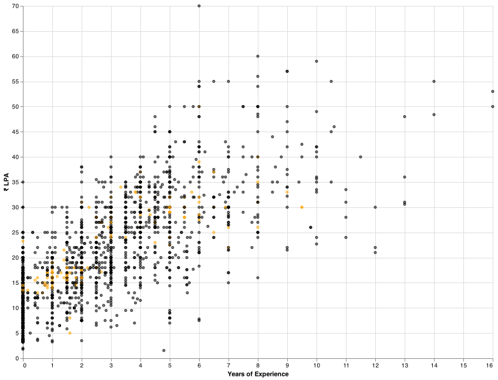
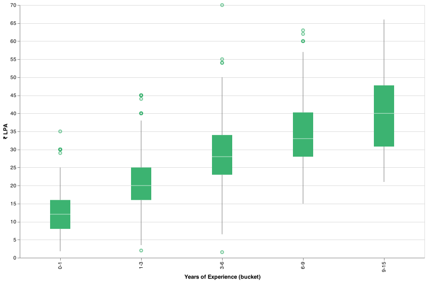

## Notes
- Reports are generated from `1962` records collected from `2019_01_05` to `2021_08_05`.
- Filtered for `India`. 
- Salary mentioned in the reports is the `fixed salary`. 
- Vertical lines in some of the charts indicate the `75th`, `95th` and the `99th` percentile of the `fixed salaries`. 

`Salary Distribution`

`Company Counts`

`Salaries by Companies`

`Salaries by Titles`

`Salaries by Experience(Amazon in orange)`

`Salaries by Experience buckets`

`Salaries by Experience buckets(top comapnies)`

## Top Offers

title : Oracle (OCI) - PMTS - India - need suggestions url : https://leetcode.com/discuss/compensation/1158640/Oracle-(OCI)-PMTS-India-need-suggestions company : `oracle` title : `ic4` yoe : `6.0` years salary : `₹ 7000000` location : `hyderabad` `post`
Education: B. Tech in CSE
Years of Experience: 6
Prior Experience: SDE 3 @ top 4 firm
Date of the Offer: Q1 2021
Company: Oracle
Title/Level: PMTS - IC4
Location: Hyderabad, India INR
Salary: 70,00,000 INR
Relocation/Signing Bonus: 24,00,000 INR (signing bonus)
Stock bonus: 2500 units = $45k per yr for 4 years
Bonus: N/A
Total comp (Salary + Bonus + Stock): 102L INR
Benefits: Standard Oracle benefits
Other details: Current TC is ~90L
Would like to hear the thoughts of the community on this.
I know it looks like a good offer, but think from 2 perspectives -
There is not a huge bump being offered over my current comp
I am concerned about OCI. I've worked with only the top 4 firms so far so also worried that this might be a step down on my profile.
lol downvoters, can you explain why you are downvoting the post? What can OP do to help improve this? ---

title : Uber | L5a | Bangalore url : https://leetcode.com/discuss/compensation/991855/Uber-or-L5a-or-Bangalore company : `uber` title : `sde 2` yoe : `8.0` years salary : `₹ 6000000` location : `bangalore` `post`
Education: B Tech from Tier 2 Uni
Years of Experience: 8 yrs
Prior Experience: Senior Developer in a startup.
Date of the Offer: December ,2020
Company: Uber
Title/Level: Senior Software Engineer( L5a )
Location: Bangalore
Base Salary: 60L
Signing Bonus: 10L
Stock bonus: 130K USD over 4 years
Performance Bonus: 12 L minimum (2x maximum)
Total comp (Base + Minimum Bonus + Sign On + Stock): 60 + 12 + 10 + 24 = 106 L
Benefits: Usual Uber Benefits (Uber Credits, 17% discount on any Uber order, etc..)
Other details: No negotiation as this was a good offer. Got a Google L4 offer as well. But rejected as they couldn't match Uber numbers.
Previous TC: 44L Base + 12.5L pre-ipo paper money ---

title : Principal Engineer Paytm url : https://leetcode.com/discuss/compensation/1245496/Principal-Engineer-Paytm company : `paytm` title : `principal engineer` yoe : `10.0` years salary : `₹ 5900000` location : `delhi` `post`
Education: B.Tech (Computer Science) Tier 3
Years of Experience: 10+
Date of the Offer: May 2021
Company: Paytm
Title/Level: Principal Engineer
Location: Noida
Salary: 59 (Fixed , including PF and Gratuity)
Relocation: NA
Signing Bonus: 100,000
Stock bonus: ESOP (30,00,000) vested over 5 years
Bonus: Performance-6,60,000 per annum
Total comp (Salary + Bonus + Stock): 66,00,000
Benefits: Standard
Current Salary : ~30
Note : I had rejected another another offer of ~50,00,000. ---

title : TESCO SDE 3 url : https://leetcode.com/discuss/compensation/1042402/TESCO-SDE-3 company : `tesco` title : `sde 3` yoe : `9.0` years salary : `₹ 5700000` location : `bangalore` `post`
Education: BE
Years of Experience: 9
Date of the Offer: Nov 2020
Company: TESCO
Title/Level: SDE 3 (Architect)
Location: Bangalore
Salary: 57,00000 (57 LPA)
Signing Bonus: 5 LPA
Stock bonus: N/A
Bonus: Performance - 15% of base (~9 LPA)
Total comp (Salary + Bonus + Stock): 71 LPA first year
Benefits: Broadband/Phone reimbursemt, Insurance, cab etc. ---

title : Gojek | Lead Software Engineer | Bangalore url : https://leetcode.com/discuss/compensation/1205518/Gojek-or-Lead-Software-Engineer-or-Bangalore company : `gojek` title : `sde 3` yoe : `9.0` years salary : `₹ 5700000` location : `bangalore` `post`
Education: B.Tech, CSE
Years of Experience: ~9 years
Prior Experience: With one of the unicorn in India
Date of Offer: March 2021
Company: Gojek
Title/Level: Lead Software Engineer
Location: Bangalore
Base Pay: 57L +3.42L PF
Annual Bonus: 11.4L which goes upto 22.8L
Signing Bonus: They don't provide
Stock Bonus: 70K USD (4 years) RSU
Total comp (Salary + Bonus): ~72L
Benefits: 6L medical insurance, various annual reimbursements worth ~50K
Interview Experience:
I applied through LinkedIn for Principal Engineer but they offered Lead Engineer position
Round1: LLD on already coded piece. Focus is on TDD
Round2: Detailed discussion around current projects/system. Certain questions around the existing design choices and different trade-offs (Two interviewers)
Round3: Design bill payments system where third-party are dynamically added. Some questions around functional paradigm and consistency guarantees with Kafka (Two interviewers)
Round4: This was the Bar Raiser round. Mostly behavioral questions
Round5: HR round on overall fitment ---

title : Goldman Sachs | VP | Bangalore url : https://leetcode.com/discuss/compensation/774516/Goldman-Sachs-or-VP-or-Bangalore company : `goldman sachs` title : `vp` yoe : `8.0` years salary : `₹ 5600000` location : `bangalore` `post`
Education: Btech CSE from NIT
Years of Experience: 8 years
Prior Experience: FAANG
Date of the Offer: 28-July-2020
Company: Goldman Sacs
Title/Level: Vice president
Location: Bengaluru
Salary: 56 LPA
Relocation/Signing Bonus: N/A
Stock bonus: 27000$ over 3 years.
Bonus: 10 LPA for first year.
Total comp (Salary + Bonus + Stock): 71 for first year (including stocks and pro rated bonus for first year).
Benefits: Standard benefits
Other details: Had other competing offers and GS barely matched the other offers.
Note : Looking for feedback from the community on the offer. I feel that i am being lowballed. ---

title : Tower Research Capital | Senior Software Engineer | Gurugram url : https://leetcode.com/discuss/compensation/1341458/Tower-Research-Capital-or-Senior-Software-Engineer-or-Gurugram company : `tower research capital` title : `sde 2` yoe : `10.5` years salary : `₹ 5500000` location : `delhi` `post`
Education:M.Tech. (IIIT-Hyd)
Years of Experience:10.5
Prior Experience:Product Based (not FAANG)
Previous Compensation: 32.5L + 3.5L Bonus
Company: Tower Research Capital
Title/Level:Senior Software Engineer
Location:Gurugram
Salary:55 LPA
Relocation/Signing Bonus:1LPA Relocation + 5 LPA Signining
Stock bonus: None
Bonus:20L
Total comp (Salary + Bonus + Stock):75L
Benefits:3.5L Yearly
Other details:10L Medical, 4xBase Salary as Term Insurance Plan ---

title : Jumio | SDE 3 (UI) | Bangalore url : https://leetcode.com/discuss/compensation/1246693/Jumio-or-SDE-3-(UI)-or-Bangalore company : `jumio` title : `sde 3` yoe : `6.0` years salary : `₹ 5500000` location : `bangalore` `post`
Education : BE
Years of Experience : 6
Prior Experience : 6 years in multiple product startups
Date of Offer : May 2021
Company: Jumio
Title : SDE 3
Location : Bangalore
Base Salary : 55,00,000
Joining Bonus : 4,00,000
Variable: 5,50,000
Stocks : 3000 ESOPs
Total CTC ~ 64,50,000 excluding ESOPs
Declined the offer as I had a better offer. ---

title : InMobi | SDE 4 | Bangalore | India url : https://leetcode.com/discuss/compensation/924416/InMobi-or-SDE-4-or-Bangalore-or-India company : `inmobi` title : `sde 4` yoe : `7.0` years salary : `₹ 5500000` location : `bangalore` `post`
Education: BTech in Computer Science
Years of Experience: 7
Prior Experience: SDE 3 at a startup
Date of the Offer: 01/11/2020
Company: InMobi
Title/Level: SDE 4 (Senior Tech Lead)
Location: Bangalore
Salary: 55,00,000 Base
Signing Bonus: 8,00,000 (4,00,000 first year + 4,00,000 second year)
Stock bonus: 50,00,000 vested over 4 years.
Total comp (Salary + Bonus + Stock): 71,00,000 (With stocks)
Benefits: Standard

Current TC: 44,00,000
Other details: Didn't negotiate yet. Don't have any competing offers as all my interviews are lined up in the next few weeks. This was supposed to be my "warm up" interview.
But I think, this offer is good and will most probably accept.

A couple of people have commented asking about my experience, career path and advice for juniors. I'm adding some more details and my thoughts here,
In my 7 YOE, I spent 4.5 years in a very early stage no-name startup. Though I was paid less here, my learnings were huge. I was responsible for whole end to end tech stack and it helped me get so much experience which would not be possible in big companies/startups. This was the main reason I was able to clear system design interviews with ease. As I had hands-on experience in each system design aspect, I did not need much preparation for that. So, in early career, join a startup with good engineering foundation and learn. It does not matter if startup fails or succeeds, you are still very young and can try out different paths at this stage.
This is not an outlier offer. This is standard for SDE 4 and above in many companies. As you could see the breakup, stocks take up a good amount of portion. InMobi is going for IPO next year. So I belive stocks would appreciate later.
Please do proper research about market standard on bli-d and other salary discussion threads. InMobi is a good company as they did not try to low-ball me and compensated me purely based on interview feedback. I was surprised to hear this number but I got to know later from bli-d posts that this was a standard offer. If I had competing offers, this number would have gone even higher.
Before a few years, I was on the same path as most of you, reading compensation threads and wondering even if they were real. But as I progressed on my career, I came to know that these numbers are very real and they are not out of reach for anybody. Just focus on your career and the money follows. ---

title : Zeta | Senior Software Development Engineer | Bangalore url : https://leetcode.com/discuss/compensation/1160327/Zeta-or-Senior-Software-Development-Engineer-or-Bangalore company : `zeta` title : `sde 2` yoe : `6.5` years salary : `₹ 5500000` location : `bangalore` `post`
Education: B.E in Computer Science (IIT/BITS)
Years of Experience: 6.5
Prior Experience: Startups
Previous Compensation: 43L + 7L stocks
Date of the Offer: April 2021
Company: Zeta Suite
Title/Level: Senior Software Development Engineer
Location: Bangalore
Salary: 55L
Signing Bonus: 5L
Stock bonus: 27L(10%, 20%, 30%, 40% vested per year)
Bonus: 5L
Total comp (Salary + Bonus + Stock): 67L first year
Benefits: Zeta benefits
Other details: Interview procedure:-PS/DSA round, Machine coding/Design discussion, Hiring manager
I had 3 other competing offers ---