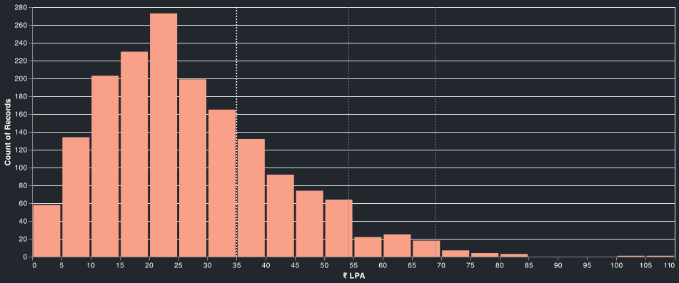
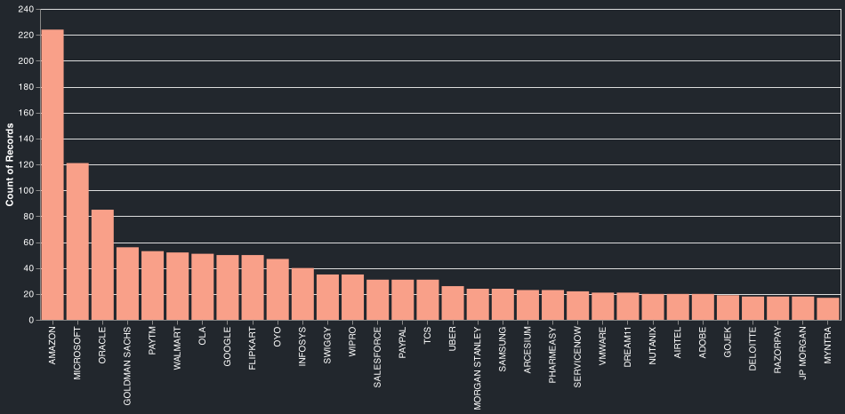
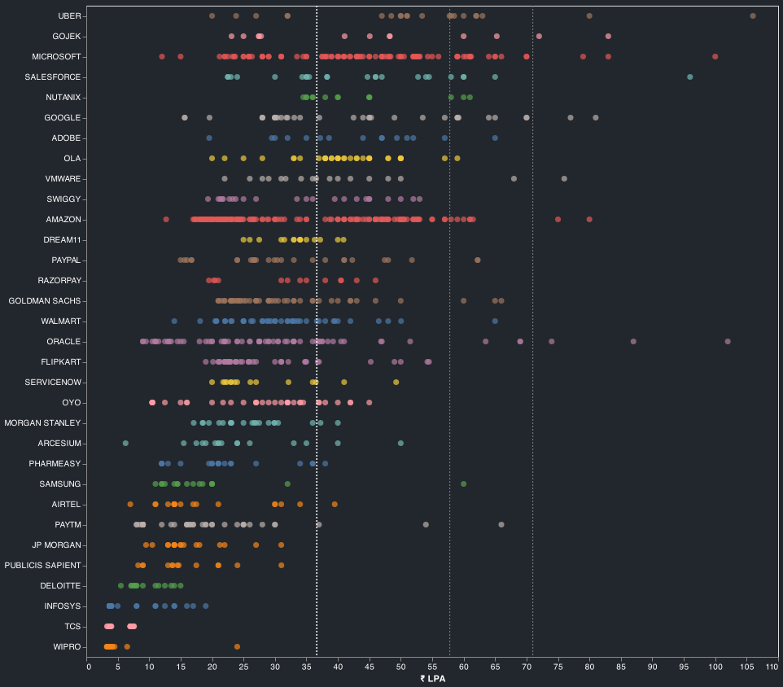
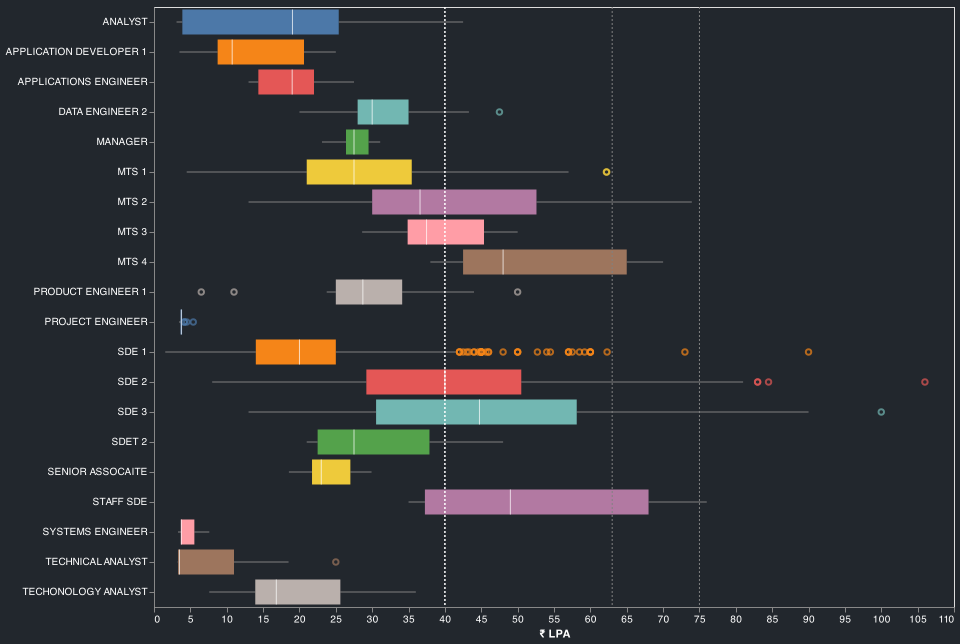
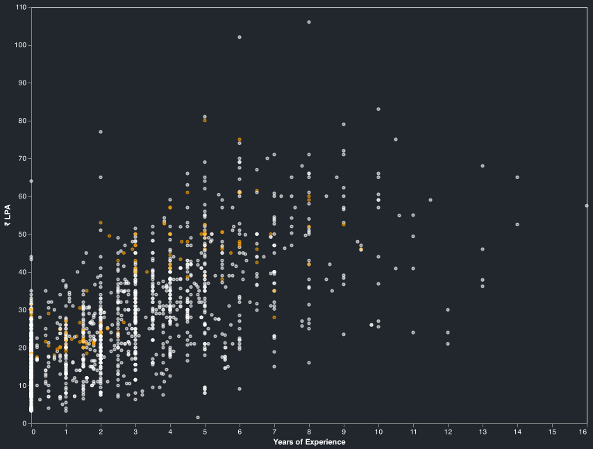
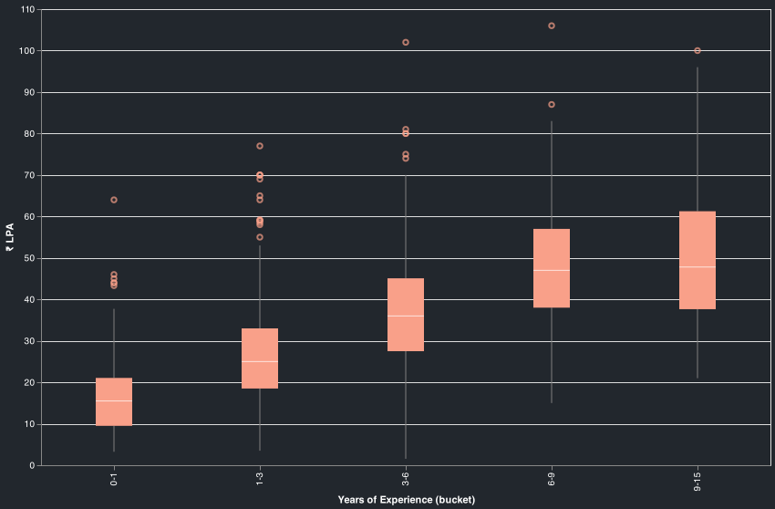
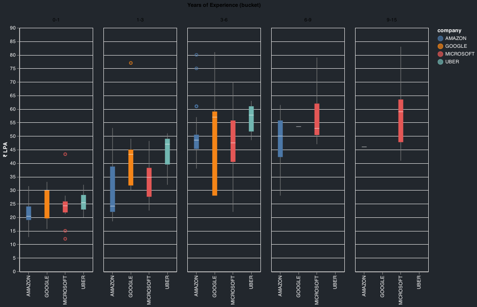

## Notes
- Reports are generated from `1705` records collected from `2019_01_05` to `2021_08_05`.
- Filtered for `India`. 
- Salary mentioned in the reports is the `total salary`. 
- Vertical lines in some of the charts indicate the `75th`, `95th` and the `99th` percentile of the `fixed salaries`. 

`Salary Distribution`

`Company Counts`

`Salaries by Companies`

`Salaries by Titles`

`Salaries by Experience(Amazon in orange)`

`Salaries by Experience buckets`

`Salaries by Experience buckets(top comapnies)`

## Top Offers

title : Uber | L5a | Bangalore url : https://leetcode.com/discuss/compensation/991855/Uber-or-L5a-or-Bangalore company : `uber` title : `sde 2` yoe : `8.0` years salary : `₹ 10600000` location : `bangalore` `post`
Education: B Tech from Tier 2 Uni
Years of Experience: 8 yrs
Prior Experience: Senior Developer in a startup.
Date of the Offer: December ,2020
Company: Uber
Title/Level: Senior Software Engineer( L5a )
Location: Bangalore
Base Salary: 60L
Signing Bonus: 10L
Stock bonus: 130K USD over 4 years
Performance Bonus: 12 L minimum (2x maximum)
Total comp (Base + Minimum Bonus + Sign On + Stock): 60 + 12 + 10 + 24 = 106 L
Benefits: Usual Uber Benefits (Uber Credits, 17% discount on any Uber order, etc..)
Other details: No negotiation as this was a good offer. Got a Google L4 offer as well. But rejected as they couldn't match Uber numbers.
Previous TC: 44L Base + 12.5L pre-ipo paper money ---

title : Oracle (OCI) - PMTS - India - need suggestions url : https://leetcode.com/discuss/compensation/1158640/Oracle-(OCI)-PMTS-India-need-suggestions company : `oracle` title : `ic4` yoe : `6.0` years salary : `₹ 10200000` location : `hyderabad` `post`
Education: B. Tech in CSE
Years of Experience: 6
Prior Experience: SDE 3 @ top 4 firm
Date of the Offer: Q1 2021
Company: Oracle
Title/Level: PMTS - IC4
Location: Hyderabad, India INR
Salary: 70,00,000 INR
Relocation/Signing Bonus: 24,00,000 INR (signing bonus)
Stock bonus: 2500 units = $45k per yr for 4 years
Bonus: N/A
Total comp (Salary + Bonus + Stock): 102L INR
Benefits: Standard Oracle benefits
Other details: Current TC is ~90L
Would like to hear the thoughts of the community on this.
I know it looks like a good offer, but think from 2 perspectives -
There is not a huge bump being offered over my current comp
I am concerned about OCI. I've worked with only the top 4 firms so far so also worried that this might be a step down on my profile.
lol downvoters, can you explain why you are downvoting the post? What can OP do to help improve this? ---

title : Microsoft | SSE | India url : https://leetcode.com/discuss/compensation/918839/Microsoft-or-SSE-or-India company : `microsoft` title : `sde 2` yoe : `10.0` years salary : `₹ 8300000` location : `india` `post`
Education: B.Tech from tier 1 college
Years of Experience: 10+
Prior Experience: Renowned Indian E-comm.
Date of the Offer: 15th September 2020
Company: Microsoft
Title/Level: Senior Software Egineer/L64
Location: India
Salary: INR 4900000
Relocation: INR 200000
Signing Bonus: INR 900000 (Over 2 years 6 + 3)
Stock bonus: $118K stock grant vested over 4 years
Bonus: Performance-based bonus up to 30% of salary every year
Total comp (Salary + Bonus + Stock): ~INR 8300000 (approximately)
Benefits: All MS Benefits
Other details: Accepted the offer.
Was on a break, prior to that TC was 48 LPA ---

title : Google | L4 | Bangalore url : https://leetcode.com/discuss/compensation/897966/Google-or-L4-or-Bangalore company : `google` title : `sde 2` yoe : `5.0` years salary : `₹ 8100000` location : `bangalore` `post`
Education: MS in Information Technology
Years of Experience: 5
Prior Experience: Unicorn Startup
Date of the Offer: Oct. 2020
Company: Google
Title/Level: Software Dev L4
Location: Bangalore
Base Salary: INR 37 lpa
Signing Bonus: INR 11 lpa
Stock bonus: $210K stock grant vested over 4 years
Bonus: 15% of base
Total comp (Salary + Bonus + Stock): INR 81 lpa + 11 signing bonus
Other details: Moving from overseas to Bangalore. Current salary is around 250K USD. ---

title : Amazon | SDE-2 | Bangalore url : https://leetcode.com/discuss/compensation/397763/Amazon-or-SDE-2-or-Bangalore company : `amazon` title : `sde 2` yoe : `5.0` years salary : `₹ 8000000` location : `bangalore` `post`
Education: BE
Years of Experience: 5
Prior Experience: Senior Software Enigineer
For experienced engineer, what's your current and past experience?
Date of the Offer: 25-Sep-2019
Company: Amazon
Title/Level: SDE-2
Location: Bangalore
Salary: 30L (INR)
Joining Bonus: 10L(INR)
Stock bonus: 32 Units
Total comp (Salary + Bonus + Stock): 80L(INR)
Benefits: All standard benifites
Other details: Bonus 10L for first year and stocks vesting in 4 years(5 % + 15 % + 40 % + 40 %)
Rejected offer as got better one ---

title : Microsoft| L63| Hyderabad url : https://leetcode.com/discuss/compensation/1062634/Microsoftor-L63or-Hyderabad company : `microsoft` title : `sde 2` yoe : `9.0` years salary : `₹ 7900000` location : `hyderabad` `post`
Education: B.Tech from IIT
Years of Experience: 9
Prior Experience: Paytm
Date of the Offer: December 2020
Company: Microsoft
Title/Level: SSE, Level 63
Location: Hyderabad, India
Salary: Rs. 47 Lacs
Signing Bonus: 5 Lacs in 1st month + 3 lacs in 13th month
Stock bonus: 140000 USD ~= Rs. 100 Lacs over 4 years (25 lacs / year)
Bonus: Performance-based bonus up to 30% of base salary / year = 14.1 lacs
Total comp (Salary + Bonus + Stock): ~ Rs. 79 Lacs (considering average 15% performance bonus)
Benefits: 15 paid vacation days + 10 paid sick leave days + 19k Gym reimbursement. Other standard MS benefits
Other details: Negotiated once, didn't result in any change as didn't have competing offers. ---

title : Google | L4 | Bangalore, India url : https://leetcode.com/discuss/compensation/1204453/Google-or-L4-or-Bangalore-India company : `google` title : `sde 2` yoe : `2.0` years salary : `₹ 7700000` location : `bangalore` `post`
Education: ME, CS
Years of Experience: 2+
Prior Experience: SE 3 with a product company
Date of the Offer: April, 2021
Company: Google
Title/Level: L4
Location: Bangalore, India
Salary: 27L
Relocation/Signing Bonus: 8.3L + 5L (only 1st year)
Stock bonus: USD 61K (4 years) and USD 61K (1.5 years)
Bonus: 15%
Total comp (Salary + Bonus + Stock): 77L (1st year)
Benefits: Food/transit/insurance etc.
Other details: Retirals not part of CTC (Given extra). ---

title : Amazon | Applied Scientist | Hyderabad url : https://leetcode.com/discuss/compensation/850244/Amazon-or-Applied-Scientist-or-Hyderabad company : `amazon` title : `applied scientist` yoe : `6.0` years salary : `₹ 7500000` location : `hyderabad` `post`
Education: Bachelors in Computer Science from IIT
Years of Experience: 6
Prior Experience: Top Tier Product Company
Date of the Offer: Spring 2020
Company: Amazon
Title/Level: Applied Scientist (Level 5)
Location: Hyderabad
Salary: INR 50,00,000 (50 lakhs)
Joining bonus: 22lakh( 1st year) , 15 lakh(2nd year)
Stock bonus: 35 units stock grant vested over 4 years( 5/15/40/40)
Total comp (Salary + Bonus + Stock): ~INR 75 lakhs
Editing post to answer questions in comments:
Previous CTC: ~45 lpa
Interview process:
1 phonescreen round
Onsite:
2 ml depth and breadth
1 coding round DSA
1 hiring manager
1 bar raiser
There was no system design round. DSA round had 2 medium problems in about 50 minutes.
Resources for ML
Probability:
Harvard Stat 110 by Blitzstein - Youtube videos and book
Statisitics:
MIT lectures by Philip Riggolet MIT 18.650
Linear Algebra:
Lectures by Gilbert Strang(original) MIT 18.06
Lectures by Gilbert Strang( Matrix methods in Signal Processing) MIT 18.065
Machine learning :
CS4780 by Kilian Weinberger 2019
CS229 Original Stanford Vidoes from Andrew Ng 2008 version ( not the watered down coursera version)
Deep Learning:
Deep learning web book by Michael Nielsen
CS224 Stanford - for NLP
CS231 Stanford - for Vision
Try to take the latest offering available on youtube
Advanced:
PGM by Eric Xiang CMU 10-708
Reinforcement Learning :
10 lectures by David Silver ---

title : Tower Research Capital | Senior Software Engineer | Gurugram url : https://leetcode.com/discuss/compensation/1341458/Tower-Research-Capital-or-Senior-Software-Engineer-or-Gurugram company : `tower research capital` title : `sde 2` yoe : `10.5` years salary : `₹ 7500000` location : `delhi` `post`
Education:M.Tech. (IIIT-Hyd)
Years of Experience:10.5
Prior Experience:Product Based (not FAANG)
Previous Compensation: 32.5L + 3.5L Bonus
Company: Tower Research Capital
Title/Level:Senior Software Engineer
Location:Gurugram
Salary:55 LPA
Relocation/Signing Bonus:1LPA Relocation + 5 LPA Signining
Stock bonus: None
Bonus:20L
Total comp (Salary + Bonus + Stock):75L
Benefits:3.5L Yearly
Other details:10L Medical, 4xBase Salary as Term Insurance Plan ---

title : Oracle OCI | IC3 | Bangalore url : https://leetcode.com/discuss/compensation/1243300/Oracle-OCI-or-IC3-or-Bangalore company : `oracle` title : `ic3` yoe : `6.0` years salary : `₹ 7400000` location : `bangalore` `post`
Education: B.tech Comp 2015
Years of Experience: 6
Prior Experience: Expedia
Date of the Offer: 24 May 2021
Company: Oracle OCI - Object Stoarge Team
Title/Level: IC3
Location: Bangalore
Salary: 48 lpa
Signing Bonus: 7 + 7 lpa
Stock bonus: 1200 units
Total comp (Salary + Bonus + Stock): 48 + 7 + 19 : 74 LPA
Benefits: Standard Oracle benefits
Other details: have competing from Walmart and InMobi ---