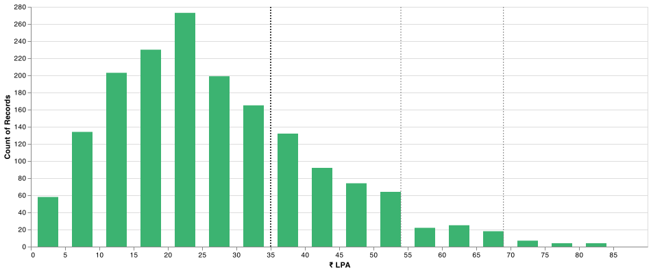
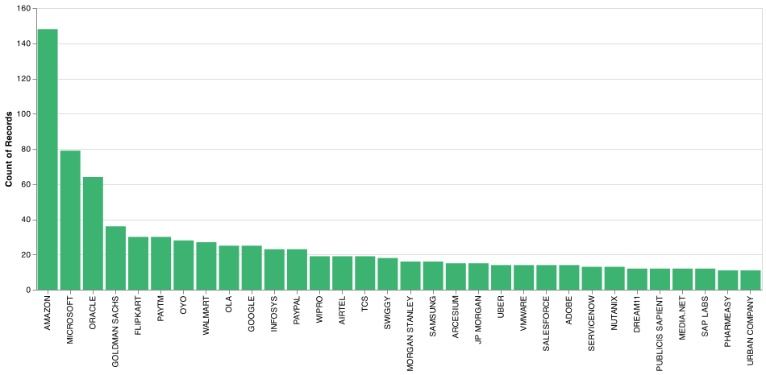
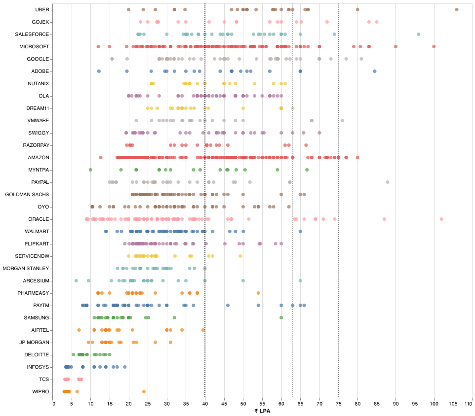
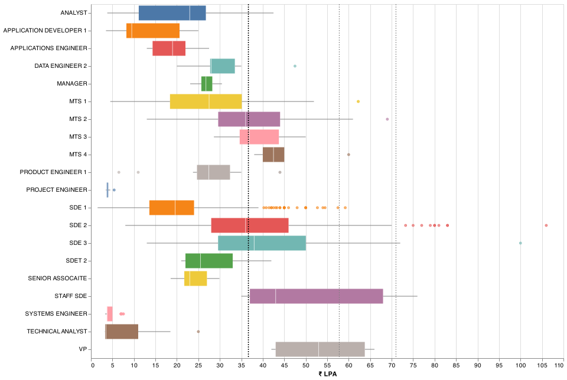
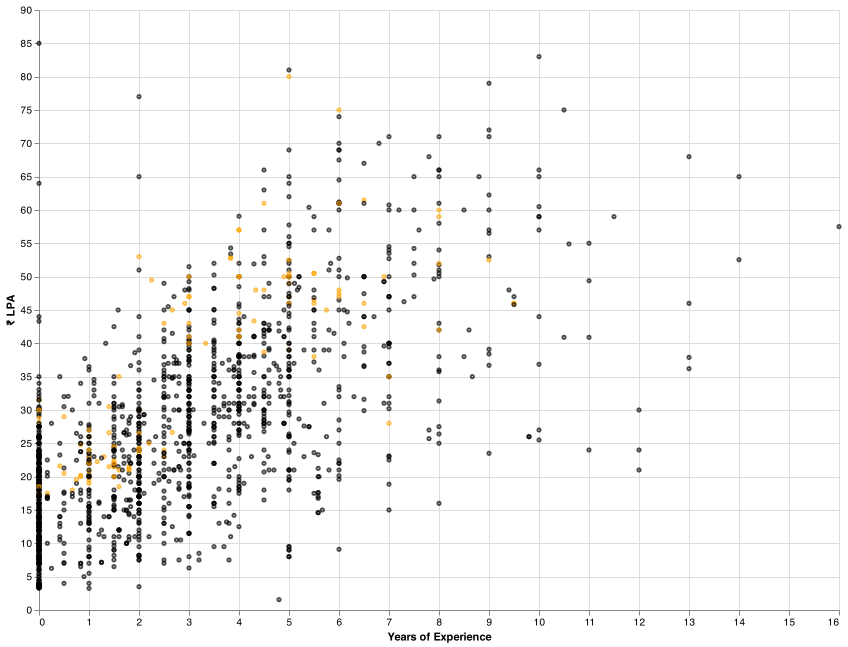
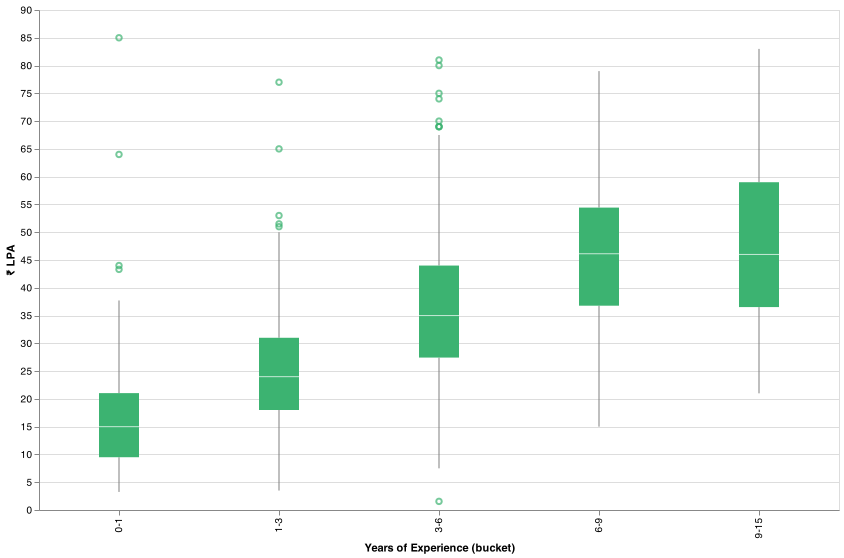
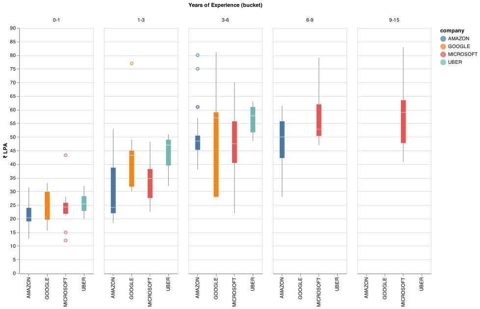

## Notes
- Reports are generated from `2017` records collected from `2019_01_05` to `2021_10_23`.
- Filtered for `India`. 
- Salary mentioned in the reports is the `total salary`. 
- Vertical lines in some of the charts indicate the `75th`, `95th` and the `99th` percentile of the `fixed salaries`. 

`Salary Distribution`

`Company Counts`

`Salaries by Companies`

`Salaries by Titles`

`Salaries by Experience(Amazon in orange)`

`Salaries by Experience buckets`

`Salaries by Experience buckets(top comapnies)`

## Top Offers

title : Uber | L5a | Bangalore url : https://leetcode.com/discuss/compensation/991855/Uber-or-L5a-or-Bangalore date : `2020/12/29` company : `uber` title : `sde 2` yoe : `8.0` years salary : `₹ 10600000` location : `bangalore` `post`
Education: B Tech from Tier 2 Uni
Years of Experience: 8 yrs
Prior Experience: Senior Developer in a startup.
Date of the Offer: December ,2020
Company: Uber
Title/Level: Senior Software Engineer( L5a )
Location: Bangalore
Base Salary: 60L
Signing Bonus: 10L
Stock bonus: 130K USD over 4 years
Performance Bonus: 12 L minimum (2x maximum)
Total comp (Base + Minimum Bonus + Sign On + Stock): 60 + 12 + 10 + 24 = 106 L
Benefits: Usual Uber Benefits (Uber Credits, 17% discount on any Uber order, etc..)
Other details: No negotiation as this was a good offer. Got a Google L4 offer as well. But rejected as they couldn't match Uber numbers.
Previous TC: 44L Base + 12.5L pre-ipo paper money ---

title : Oracle (OCI) - PMTS - India - need suggestions url : https://leetcode.com/discuss/compensation/1158640/Oracle-(OCI)-PMTS-India-need-suggestions date : `2021/04/15` company : `oracle` title : `ic4` yoe : `6.0` years salary : `₹ 10200000` location : `hyderabad` `post`
Education: B. Tech in CSE
Years of Experience: 6
Prior Experience: SDE 3 @ top 4 firm
Date of the Offer: Q1 2021
Company: Oracle
Title/Level: PMTS - IC4
Location: Hyderabad, India INR
Salary: 70,00,000 INR
Relocation/Signing Bonus: 24,00,000 INR (signing bonus)
Stock bonus: 2500 units = $45k per yr for 4 years
Bonus: N/A
Total comp (Salary + Bonus + Stock): 102L INR
Benefits: Standard Oracle benefits
Other details: Current TC is ~90L
Would like to hear the thoughts of the community on this.
I know it looks like a good offer, but think from 2 perspectives -
There is not a huge bump being offered over my current comp
I am concerned about OCI. I've worked with only the top 4 firms so far so also worried that this might be a step down on my profile.
lol downvoters, can you explain why you are downvoting the post? What can OP do to help improve this? ---

title : Microsoft | L63 | Bangalore url : https://leetcode.com/discuss/compensation/1462800/Microsoft-or-L63-or-Bangalore date : `2021/09/14` company : `microsoft` title : `sde 3` yoe : `12.0` years salary : `₹ 10000000` location : `bangalore` `post`
Education: B.Tech
Years of Experience: 12
Prior Experience: Oracle, Amazon
Date of the Offer: July 2021
Company: Microsoft
Title/Level: L63
Location: Bangalore
Base Salary: 45L (Incl. PF)
Performance Bonus:- 30%
Signing Bonus: 10L (5L + 5L)
Stock bonus: 37L for first year (200K over 4 years)
Total comp (Salary + Bonus + Stock): 100L per year ---

title : Salesforce | LMTS | Hyderabad | India url : https://leetcode.com/discuss/compensation/1431797/Salesforce-or-LMTS-or-Hyderabad-or-India date : `2021/08/29` company : `salesforce` title : `n/a` yoe : `9.5` years salary : `₹ 9600000` location : `hyderabad` `post`
Disclaimer : This discussion was on phone with the HR. While waiting for the offer letter, I got better offer from somewhere else and moved on
https://leetcode.com/discuss/compensation/1431639/Rubrik-or-Senior-or-Bangalore-or-India
Education: BE in Computer Science
Years of Experience: 9.5
Prior Experience: 1 year in Samsung and then 8.5 years in a leading tech company
Date of the Offer: Jan 2021
Company: Salesforce
Title/Level: LMTS
Location: Hyderabad, India
Salary: 60L INR
Relocation: 0 (same city)
Signing Bonus: 6L
Stock bonus: 96L (24L per year for 4 years)
Bonus: 6L (min 10% of basic salary)
Total comp (Salary + Bonus + Stock ) ~ 96L
CTC in current (then) company : 42.
Other details : I think this was offer was good. Got this since i already was holding 87L : https://leetcode.com/discuss/compensation/1431629/Oracle-or-Principal-or-Bangalore-or-India ---

title : Oracle | Principal | Bangalore | India url : https://leetcode.com/discuss/compensation/1431629/Oracle-or-Principal-or-Bangalore-or-India date : `2021/08/29` company : `oracle` title : `n/a` yoe : `9.0` years salary : `₹ 8700000` location : `bangalore` `post`
Education: BE in Computer Science
Years of Experience: 9
Prior Experience: 1 year in Samsung and then 8 years in a leading tech company
Date of the Offer: Nov 2020
Company: Oracle (OCI)
Title/Level: Principal Member of Technical Staff
Location: Bangalore, India
Salary: 56L INR
Relocation: 5L
Signing Bonus: 12L (6+6) for two years
Stock bonus: 80L (20L per year for 4 years)
Bonus: Performance- No clear mention
Total comp (Salary + Bonus + Stock + Rolocation ): 87L
CTC in current (then) company : 42.
Other details: Did not expect such an offer from Oracle. I had good experince in cloud and that might have been the reason. Did not accept. Got better offers.
Other offers
https://leetcode.com/discuss/compensation/1431639/Rubrik-or-Senior-or-Bangalore-or-India
https://leetcode.com/discuss/compensation/1431797/Salesforce-or-Tech-Lead-or-Hyderabad-or-India ---

title : Gojek | SDE2 | Bengaluru url : https://leetcode.com/discuss/compensation/1530798/Gojek-or-SDE2-or-Bengaluru date : `2021/10/20` company : `gojek` title : `sde 2` yoe : `7.3` years salary : `₹ 8300000` location : `bangalore` `post`
Education: BE (new gen IITs )
Years of Experience: 7.3
Prior Experience: Ola
For fresh grad, any related Internship/coop experience? N/A
Date of the Offer: 1st Oct
Company:Gojek
Title/Level: SDE2
Location: Bengaluru
Salary: 63 LPA INR (Base + PF + retirals ...)
Relocation/Signing Bonus: 3.2
Stock bonus: 4 RSU /Year
Bonus: 20 Pc
Total comp (Salary + Bonus + Stock): (63 + 8 + 12) : 83 LPA
Benefits: standard Gojek stuff
Other details: Competing offer from OCI, they could not match numbers
Feedback needed: what is the realistic variable pay at GJK? ---

title : Microsoft | SSE | India url : https://leetcode.com/discuss/compensation/918839/Microsoft-or-SSE-or-India date : `2020/11/01` company : `microsoft` title : `sde 2` yoe : `10.0` years salary : `₹ 8300000` location : `india` `post`
Education: B.Tech from tier 1 college
Years of Experience: 10+
Prior Experience: Renowned Indian E-comm.
Date of the Offer: 15th September 2020
Company: Microsoft
Title/Level: Senior Software Egineer/L64
Location: India
Salary: INR 4900000
Relocation: INR 200000
Signing Bonus: INR 900000 (Over 2 years 6 + 3)
Stock bonus: $118K stock grant vested over 4 years
Bonus: Performance-based bonus up to 30% of salary every year
Total comp (Salary + Bonus + Stock): ~INR 8300000 (approximately)
Benefits: All MS Benefits
Other details: Accepted the offer.
Was on a break, prior to that TC was 48 LPA ---

title : Compass | Senior Software Engineer - Front End (IC3) | Hyderabad url : https://leetcode.com/discuss/compensation/1517624/Compass-or-Senior-Software-Engineer-Front-End-(IC3)-or-Hyderabad date : `2021/10/12` company : `compass` title : `n/a` yoe : `9.0` years salary : `₹ 8100000` location : `hyderabad` `post`
Education: Masters - Tier 2 College
Years of Experience: 9
Prior Experience: Product companies
Date of the Offer: July 2021
Company: Compass
Title/Level: Senior Software Engineer - Front End (IC3)
Location: Hyderabad
Salary: 60L
Relocation/Signing Bonus: 1L
Stock bonus: 55 L vesting over 4 years. Refresher bonus were also there after 1 year based on performance.
Bonus: 10% of base.
Total comp (Salary + Bonus + Stock): 60 + 1 + 6 + 13.5 = ~81 L
Benefits: Phone + Internet + Health.
Interview Experience here
Status: Rejected the offer as got another offer with more base and way more stocks. ---

title : Google | L4 | Bangalore url : https://leetcode.com/discuss/compensation/897966/Google-or-L4-or-Bangalore date : `2020/10/17` company : `google` title : `sde 2` yoe : `5.0` years salary : `₹ 8100000` location : `bangalore` `post`
Education: MS in Information Technology
Years of Experience: 5
Prior Experience: Unicorn Startup
Date of the Offer: Oct. 2020
Company: Google
Title/Level: Software Dev L4
Location: Bangalore
Base Salary: INR 37 lpa
Signing Bonus: INR 11 lpa
Stock bonus: $210K stock grant vested over 4 years
Bonus: 15% of base
Total comp (Salary + Bonus + Stock): INR 81 lpa + 11 signing bonus
Other details: Moving from overseas to Bangalore. Current salary is around 250K USD. ---

title : Rippling | SDE2 | Bangalore url : https://leetcode.com/discuss/compensation/1424704/Rippling-or-SDE2-or-Bangalore date : `2021/08/25` company : `uber` title : `sde 2` yoe : `4.0` years salary : `₹ 8000000` location : `bangalore` `post`
Education: Btech in Computer Science
Years of Experience: 4+
Prior Experience: Uber
Date of the Offer: 2021
Company: Uber
Title/Level: Software Dev.2
Location: Bangalore, India
Salary: 50,00,000
Relocation: Can be reimbursed
Signing Bonus: 10,00,000
Stock bonus: ESOPS 12,000 units priced at ~100 usd per unit 25% vest each year~ 20,00,000 per year
Bonus: NA
Total comp (Salary + Bonus + Stock): ~80,00,000
Benefits: Standard rippling benifits
Other details: Interviews went very well so top of the band offer from rippling, But rejected as was planning to move outside of India in few months. ---