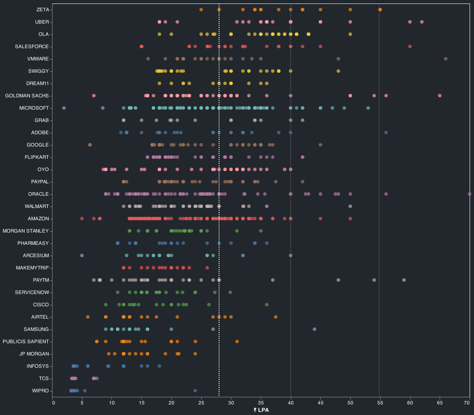
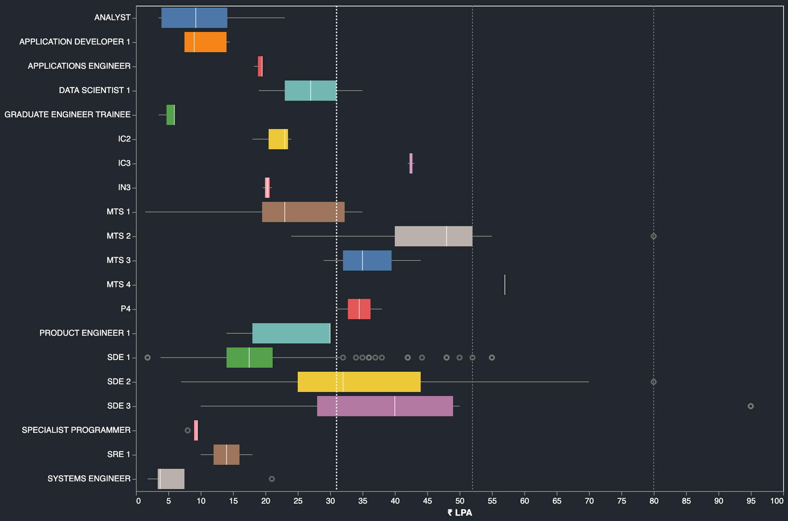
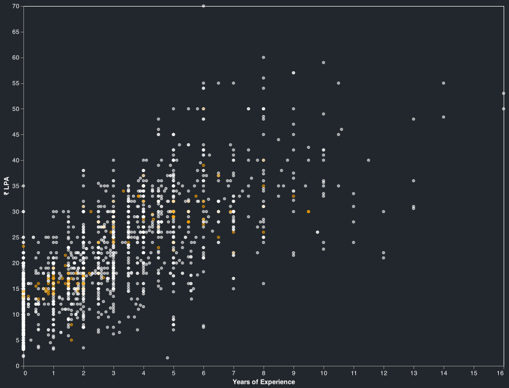
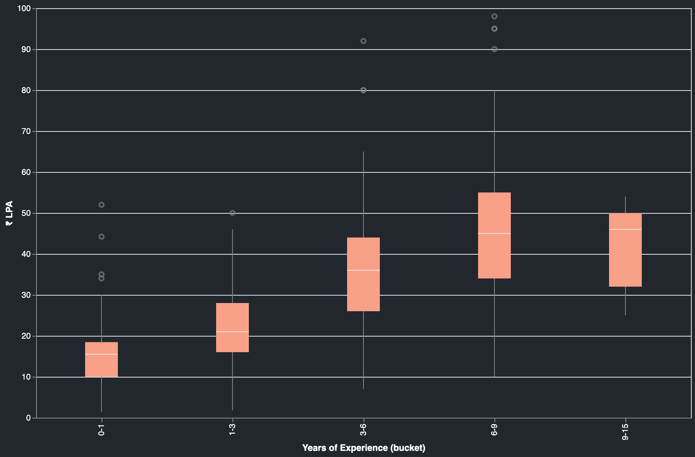
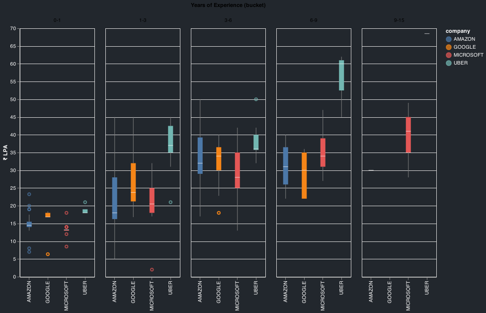

## Notes
- Reports are generated from `2914` records collected from `2019_01_05` to `2022_01_18`.
- Filtered for `India`. 
- Salary mentioned in the reports is the `fixed salary`. 
- Vertical lines in some of the charts indicate the `75th`, `95th` and the `99th` percentile of the `fixed salaries`. 

`Salary Distribution`

`Company Counts`

`Salaries by Companies`

`Salaries by Titles`

`Salaries by Experience(Amazon in orange)`

`Salaries by Experience buckets`

`Salaries by Experience buckets(top comapnies)`

## Top Offers

title : Oracle (OCI) - PMTS - India - need suggestions url : https://leetcode.com/discuss/compensation/1158640/Oracle-(OCI)-PMTS-India-need-suggestions date : `2021/04/15` company : `oracle` title : `ic4` yoe : `6.0` years salary : `₹ 7000000` location : `hyderabad` `post`
Education: B. Tech in CSE
Years of Experience: 6
Prior Experience: SDE 3 @ top 4 firm
Date of the Offer: Q1 2021
Company: Oracle
Title/Level: PMTS - IC4
Location: Hyderabad, India INR
Salary: 70,00,000 INR
Relocation/Signing Bonus: 24,00,000 INR (signing bonus)
Stock bonus: 2500 units = $45k per yr for 4 years
Bonus: N/A
Total comp (Salary + Bonus + Stock): 102L INR
Benefits: Standard Oracle benefits
Other details: Current TC is ~90L
Would like to hear the thoughts of the community on this.
I know it looks like a good offer, but think from 2 perspectives -
There is not a huge bump being offered over my current comp
I am concerned about OCI. I've worked with only the top 4 firms so far so also worried that this might be a step down on my profile.
lol downvoters, can you explain why you are downvoting the post? What can OP do to help improve this? ---

title : UBER | SSE (5A) | Hyderabad url : https://leetcode.com/discuss/compensation/1591265/UBER-or-SSE-(5A)-or-Hyderabad date : `2021/11/22` company : `uber` title : `sde 2` yoe : `11.5` years salary : `₹ 6850000` location : `hyderabad` `post`
Uber Offer Details
Education: Bachelor's in Computer Science
Years of Experience: 11.5
Prior Experience: Multiple Companies, latest being a Top Product Company
Date of the Offer: 15-11-2021
Company: Uber
Title/Level: Senior Software Engineer (5A)
Location: Hyderabad
Salary: 68,50,000 INR
Relocation/Signing Bonus: 10,00,000 (signing bonus)
Stock bonus: 185k USD (vested over 4 years)
Bonus: 12,00,000 - 24,00,000 (Based on Performance)
Total comp (Salary + Bonus + Stocks ): ~1.2 Cr
Benefits: Standard Uber benfits
Other details: Had a competing offer in 80-90L range
Current Compensation - 30L (Including Stocks and Bonus)
Interview Experience - https://leetcode.com/discuss/interview-experience/1591280/UBER-or-SSE(5A)-or-Hyderabad-(Offer) ---

title : GOJEK | SDE-3 url : https://leetcode.com/discuss/compensation/1603144/GOJEK-or-SDE-3 date : `2021/11/30` company : `gojek` title : `sde 3` yoe : `5.3` years salary : `₹ 6800000` location : `bangalore` `post`
Education: BE (Tier 3)
Years of Experience: 5.3
Prior Experience: Flipkart
Date of the Offer: 29 Nov
Company:Gojek
Title/Level: SDE3
Location: Bengaluru
Salary: 68 LPA INR (Base )
Relocation/Signing Bonus: 5
Stock bonus: 5 RSU /Year
Variable Bonus: 12L
Total comp (Salary + Bonus + Stock): (68 + 5 + 12) : 85 LPA
Benefits: standard Gojek stuff ---

title : Rubrik | Senior | Bangalore | India url : https://leetcode.com/discuss/compensation/1431639/Rubrik-or-Senior-or-Bangalore-or-India date : `2021/08/29` company : `rubrik` title : `sde 2` yoe : `9.5` years salary : `₹ 6600000` location : `bangalore` `post`
Education: BE in Computer Science
Years of Experience: 9.5
Prior Experience: 1 year in Samsung and then 8.5 years in a leading tech company
Date of the Offer: Feb 2021
Company: Rubrik
Title/Level: Senior Software Engineer
Location: Bangalore, India
Salary: 66L INR
Relocation: 1.25L
Signing Bonus: 6L
Stock bonus: 120L (30L per year for 4 years, Rubrik is yet to go for IPO, stock price was calculated at 23$ per share)
Bonus: 10L (min 15% of basic salary)
Total comp (Salary + Bonus + Stock + Rolocation ) ~ 1.13 Cr
CTC in current (then) company : 42.
Other details: Did not accept. Was an amazing offer. I think I got this since was already holding offers of 87L and 95L. In the end, got another good offer outside India.
Other offers :
https://leetcode.com/discuss/compensation/1431629/Oracle-or-Principal-or-Bangalore-or-India
https://leetcode.com/discuss/compensation/1431797/salesforce-lmts-hyderabad-india/1064638
Edit : Here are the details of my interviewing experience : https://leetcode.com/discuss/interview-experience/1445033/A-story-of-2-innings%3A-Getting-9-rejections-and-4-offers ---

title : VMWare|Staff Engineer| Bangalore url : https://leetcode.com/discuss/compensation/1476661/VMWareorStaff-Engineeror-Bangalore date : `2021/09/21` company : `vmware` title : `staff sde` yoe : `10.0` years salary : `₹ 6600000` location : `bangalore` `post`
Education: B.Tech in IT
Years of Experience: 10
Prior Experience: Software Engineer at Cisco
Company: Vmware
Title/Level: Staff Engineer
Location: Bangalore, India
Salary: 66L INR (55 base + 11L Bonus )
Relocation: 0
Signing Bonus: 0
Stock bonus: $52K, vested equally for 4 years
Total comp (Salary + Bonus + Stock): 55 + 11 + ~10 = 76L for first year
Benefits: Standard vmware benefits
Previous CTC(base + bonus): 24+ 7= 31L
4 Rounds of Interview.
1st Round was a system design round around a real time streaming platform similar to Twitter.
2nd round - 2 Leetcode medium questions based on tree and graph (https://leetcode.com/problems/most-frequent-subtree-sum/, Implement a DAG)
3rd Round - 1 Leetcode medium question on arrays (Rain water tapping) and the interviewer went into variations of the problem.
4th Round - Started with Leetcode easy question on LCA in a BST, then went on to ask questions on internal working of cassandra database. Ended with a system design question to design a event driven shopping cart .
Managerial round was more around my CV and my work experiences. ---

title : Goldman Sachs | VP | Bangalore/Hyderabad url : https://leetcode.com/discuss/compensation/1520775/Goldman-Sachs-or-VP-or-BangaloreHyderabad date : `2021/10/14` company : `goldman sachs` title : `vp` yoe : `10.0` years salary : `₹ 6500000` location : `bangalore` `post`
Education: Tier 1 Non CS
Years of Experience: 10+
Prior Experience: Senior Software engineer at a product company
Date of offer: September 2021
Company: Goldman Sachs
Title: VP (tech) (Work related to C++ development.)
Location: Bangalore/Hyderabad
Salary: 65,00,000 (Base + PF)
Stock bonus: 40k over next 4 years only to compensate the RSUs which I had in my current job
Joining Bonus : 0
Performance Bonus : 40% of Base (Its only verbal commitment not in written)
Benefits: Standard Goldman Sachs benefits
Other Details: Rejected as had other offer in hand. Also, 3 months notice with GS. Did not like he interview process.
Other offer : https://leetcode.com/discuss/compensation/1522168/Adobe-or-Sr.-Computer-Scientist-or-Noida ---

title : Gojek | SDE2 | Bengaluru url : https://leetcode.com/discuss/compensation/1530798/Gojek-or-SDE2-or-Bengaluru date : `2022/01/15` company : `gojek` title : `sde 2` yoe : `7.3` years salary : `₹ 6300000` location : `bangalore` `post`
Education: BE (new gen IITs )
Years of Experience: 7.3
Prior Experience: Ola
For fresh grad, any related Internship/coop experience? N/A
Date of the Offer: 1st Oct
Company:Gojek
Title/Level: SDE2
Location: Bengaluru
Salary: 63 LPA INR (Base + PF + retirals ...)
Relocation/Signing Bonus: 3.2
Stock bonus: 4 RSU /Year
Bonus: 20 Pc
Total comp (Salary + Bonus + Stock): (63 + 8 + 12) : 83 LPA
Benefits: standard Gojek stuff
Other details: Competing offer from OCI, they could not match numbers
Feedback needed: what is the realistic variable pay at GJK? ---

title : Uber | Sr. Software engineer (L5A) | Hyderabad url : https://leetcode.com/discuss/compensation/1425589/Uber-or-Sr.-Software-engineer-(L5A)-or-Hyderabad date : `2021/08/25` company : `uber` title : `n/a` yoe : `9.0` years salary : `₹ 6200000` location : `hyderabad` `post`
Education: B.Tech in Computer Science from NIT Allahabad
Years of Experience: 9
Prior Experience: SDE-2 at Amazon
Date of the Offer: August 2021
Company: Uber
Title/Level: Sr. Software Development Engineer
Location: Hyderabad, India
Base Salary: 62LPA
Relocation: 3L
Stock bonus: $175K stock grant vested over 4 years
Performance Bonus: 12.96LPA minimum (2x maximum)
Total comp (Salary + Bonus + Stock): ~1.07Cr
Benefits: Usual Uber Benefits (Uber Credits, 17% discount on any Uber order, Fitness reimbursements etc..)
Other details: None ---

title : Compass | Senior Software Engineer - Front End (IC3) | Hyderabad url : https://leetcode.com/discuss/compensation/1517624/Compass-or-Senior-Software-Engineer-Front-End-(IC3)-or-Hyderabad date : `2021/10/12` company : `compass` title : `n/a` yoe : `9.0` years salary : `₹ 6000000` location : `hyderabad` `post`
Education: Masters - Tier 2 College
Years of Experience: 9
Prior Experience: Product companies
Date of the Offer: July 2021
Company: Compass
Title/Level: Senior Software Engineer - Front End (IC3)
Location: Hyderabad
Salary: 60L
Relocation/Signing Bonus: 1L
Stock bonus: 55 L vesting over 4 years. Refresher bonus were also there after 1 year based on performance.
Bonus: 10% of base.
Total comp (Salary + Bonus + Stock): 60 + 1 + 6 + 13.5 = ~81 L
Benefits: Phone + Internet + Health.
Interview Experience here
Status: Rejected the offer as got another offer with more base and way more stocks. ---

title : Salesforce | LMTS | Hyderabad | India url : https://leetcode.com/discuss/compensation/1431797/Salesforce-or-LMTS-or-Hyderabad-or-India date : `2021/08/29` company : `salesforce` title : `n/a` yoe : `9.5` years salary : `₹ 6000000` location : `hyderabad` `post`
Disclaimer : This discussion was on phone with the HR. While waiting for the offer letter, I got better offer from somewhere else and moved on
https://leetcode.com/discuss/compensation/1431639/Rubrik-or-Senior-or-Bangalore-or-India
Education: BE in Computer Science
Years of Experience: 9.5
Prior Experience: 1 year in Samsung and then 8.5 years in a leading tech company
Date of the Offer: Jan 2021
Company: Salesforce
Title/Level: LMTS
Location: Hyderabad, India
Salary: 60L INR
Relocation: 0 (same city)
Signing Bonus: 6L
Stock bonus: 96L (24L per year for 4 years)
Bonus: 6L (min 10% of basic salary)
Total comp (Salary + Bonus + Stock ) ~ 96L
CTC in current (then) company : 42.
Other details : I think this was offer was good. Got this since i already was holding 87L : https://leetcode.com/discuss/compensation/1431629/Oracle-or-Principal-or-Bangalore-or-India ---